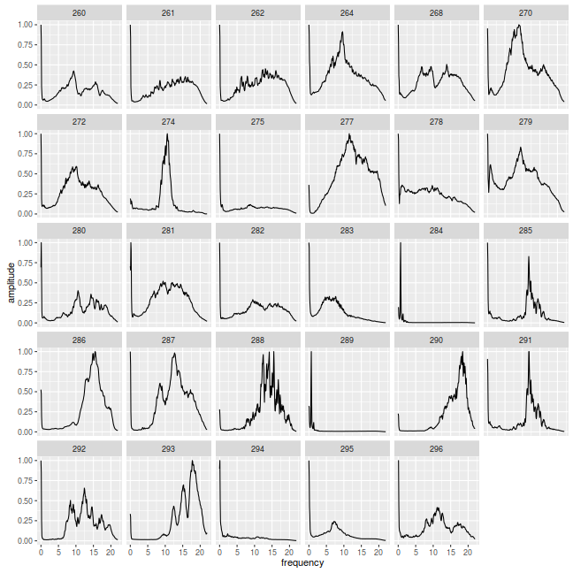
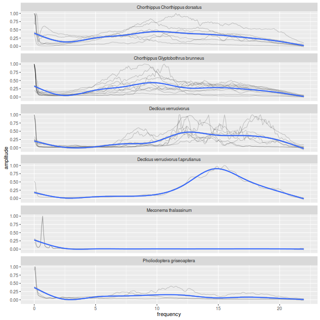

bioacousticaR
===================

[](https://travis-ci.org/BioAcoustica/bioacousticaR)

An `R` package interfacing [BioAcoustica](http://bio.acousti.ca).

BioAcoustica is a sound repository and analysis platform for recordings of wildlife sound.
This package provides a toolbox to search and retrieve recordings in order to build a local collection for subsequent analysis.


A world of annotations
----------------------------

Bioacoustica web server allows users to tag segments of recordings.
This generates so called **"annotations"**.
Each annotation has a unique identifier, a parent audio file, a start and an end time, and other informations (taxon, author,...).

An analysis project will generally involve:

* Uploading recordings
* Annotating regions of interest
* Downloading and analysing annotation audio data

The [BioAcoustica website](http://bio.acousti.ca) should allow users to perform the two first actions, whilst the package herein focuses on the last point.
In other words, `bioacousticaR` is a tool to fetch files corresponding to annotations in order to process them locally.

A concrete example:
----------------------

A bioacoustica user, `qgeissmann`, performed annotations online between October 22th and November 1st. We would like to fetch all the corresponding data, save it locally and analyse it.

In `R`, we will start by listing available annotations:


```r
library(bioacoustica)
all_annotations <- getAllAnnotationData()
```

`all_annotation` is a `data.table` (a `data.table` is essentially a `data.frame` with extra functionalities) containing a list of annotations (one per row). Let us have a look at the fields available:


```r
colnames(all_annotations)
```

```
##  [1] "id"            "type"          "taxon"         "taxon_id"     
##  [5] "start"         "end"           "file"          "recording"    
##  [9] "original_tape" "author"        "date"
```

In order to select three columns of interest (here, author, date of annotation and taxon), once can do something like:


```r
all_annotations[, .(author, date, taxon)]
```

```
##            author                date                   taxon
##   1: Edward Baker 2014-12-08 14:35:00                        
##   2: Edward Baker 2014-12-08 15:00:00                        
##   3: Edward Baker 2014-12-08 15:01:00   Conocephalus discolor
##   4: Edward Baker 2014-12-08 16:02:00 Gryllotalpa gryllotalpa
##   5: Edward Baker 2014-12-08 16:28:00                        
##  ---                                                         
## 208:   qgeissmann 2016-11-04 17:41:00     Nemobius sylvestris
## 209:   qgeissmann 2016-11-04 17:49:00     Nemobius sylvestris
## 210:   qgeissmann 2016-11-04 17:50:00     Nemobius sylvestris
## 211:   qgeissmann 2016-11-04 18:24:00     Nemobius sylvestris
## 212:   qgeissmann 2016-11-04 18:26:00     Nemobius sylvestris
```

We then can *select* the subset of annotation we are interested about. For instance, all annotations made by "qgeissmann", after "2016-10-22" and before after "2016-11-01".


```r
target_annotations <- all_annotations[author == "qgeissmann" &
                                      date > "2016-10-22" &
                                      date < "2016-11-01"]
target_annotations[, .(author, date, taxon)]
```

```
##         author                date                              taxon
##  1: qgeissmann 2016-10-26 17:13:00 Chorthippus Glyptobothrus brunneus
##  2: qgeissmann 2016-10-26 17:15:00 Chorthippus Glyptobothrus brunneus
##  3: qgeissmann 2016-10-26 17:17:00 Chorthippus Glyptobothrus brunneus
##  4: qgeissmann 2016-10-26 17:18:00 Chorthippus Glyptobothrus brunneus
##  5: qgeissmann 2016-10-26 17:19:00 Chorthippus Glyptobothrus brunneus
##  6: qgeissmann 2016-10-26 17:21:00 Chorthippus Glyptobothrus brunneus
##  7: qgeissmann 2016-10-26 17:23:00 Chorthippus Glyptobothrus brunneus
##  8: qgeissmann 2016-10-26 17:26:00 Chorthippus Glyptobothrus brunneus
##  9: qgeissmann 2016-10-26 17:27:00 Chorthippus Glyptobothrus brunneus
## 10: qgeissmann 2016-10-26 17:31:00   Chorthippus Chorthippus dorsatus
## 11: qgeissmann 2016-10-26 17:33:00   Chorthippus Chorthippus dorsatus
## 12: qgeissmann 2016-10-26 17:35:00   Chorthippus Chorthippus dorsatus
## 13: qgeissmann 2016-10-26 17:36:00   Chorthippus Chorthippus dorsatus
## 14: qgeissmann 2016-10-26 17:37:00   Chorthippus Chorthippus dorsatus
## 15: qgeissmann 2016-10-26 17:38:00 Chorthippus Glyptobothrus brunneus
## 16: qgeissmann 2016-10-26 18:07:00   Chorthippus Chorthippus dorsatus
## 17: qgeissmann 2016-10-26 18:23:00               Meconema thalassinum
## 18: qgeissmann 2016-10-26 18:29:00              Decticus verrucivorus
## 19: qgeissmann 2016-10-26 18:29:00 Decticus verrucivorus f.aprutianus
## 20: qgeissmann 2016-10-26 18:31:00              Decticus verrucivorus
## 21: qgeissmann 2016-10-26 18:34:00              Decticus verrucivorus
## 22: qgeissmann 2016-10-26 18:36:00               Meconema thalassinum
## 23: qgeissmann 2016-10-26 18:38:00              Decticus verrucivorus
## 24: qgeissmann 2016-10-26 18:40:00              Decticus verrucivorus
## 25: qgeissmann 2016-10-26 18:41:00              Decticus verrucivorus
## 26: qgeissmann 2016-10-26 18:43:00              Decticus verrucivorus
## 27: qgeissmann 2016-10-26 19:03:00         Pholiodoptera griseoaptera
## 28: qgeissmann 2016-10-26 19:05:00         Pholiodoptera griseoaptera
## 29: qgeissmann 2016-10-26 19:06:00         Pholiodoptera griseoaptera
##         author                date                              taxon
```

Now we can actually download one audio segment for each annotation.
We just need to define where to save these files.
In a real life scenario, you would manage and create your own directory.
However, for the sake of the example, we will create a temporary one (`DATA_DIR`).


```r
DATA_DIR <- file.path(tempdir(),"ba_example")
dir.create(DATA_DIR)
target_annotations <- dowloadFilesForAnnotations(
                                target_annotations,
                                dst_dir = DATA_DIR,
                                verbose=T)
```

Now, `target_annotations` has been updated with a new column (`annotation_path`) that refers to the path of the saved file.
By default, a file that was already present in the directory will not be re-downloaded, so your collection can be built *incrementally*.

As a simple example, we could open each file and retrieve its duration. First, we define a simple function that takes an arbitrary wave file, and return its duration:


```r
getDuration <- function(file){
  wav <- tuneR::readWave(file)
  length(wav@left) / wav@samp.rate
}
```

Then, we can apply this function using `data.table` `by` argument.
the following statement means "for each unique id compute `getDuration()`, and store it as a column called `duration`):


```r
# we use the magic of data.table `by`:
durations  <- target_annotations[ ,
                                  .(duration = getDuration(annotation_path)),
                                  by=id]
print(durations)
```

```
##      id  duration
##  1: 260 19.058345
##  2: 261 18.993039
##  3: 262 18.989229
##  4: 264 12.243469
##  5: 268 11.875578
##  6: 270 12.920385
##  7: 272 12.400839
##  8: 274 30.000023
##  9: 275  8.885102
## 10: 277  8.554036
## 11: 278 11.597211
## 12: 279 13.141247
## 13: 280 15.073311
## 14: 281 12.697075
## 15: 282  6.716485
## 16: 283 17.584875
## 17: 284  7.154853
## 18: 285 29.279660
## 19: 286 27.145692
## 20: 287 29.249093
## 21: 288 29.018073
## 22: 289 13.700340
## 23: 290 29.278571
## 24: 291 29.071224
## 25: 292 21.869501
## 26: 293 26.291270
## 27: 294 23.636032
## 28: 295 19.821429
## 29: 296 28.211088
##      id  duration
```

This way, we have one annotation per id.

The same approach can be used to make much more complicated analysis. For instance, you could replace `getDuration()` by a function that computes a power spectrum (as long as you return it as a `data.table`).


For instance, we would like to make a mean frequency spectrum (`seewave::meanspec`) for each annotation, and then plot spectrum vs species. Again, we start by making a function. This time, it returns a data.table (or data.frame) which contains the data of the power spectrum. That is one column for the power and one for the frequency.
 
 

```r
library(seewave)
powerSpectrum <- function(file){
  wav <- tuneR::readWave(file)
  mspec  <- meanspec(wave = wav, plot=F)
  data.table(amplitude = mspec[,"y"] , frequency = mspec[,"x"])
}
```


```r
power_spectra  <- target_annotations[ ,
                                  powerSpectrum(annotation_path),
                                  by=id]
power_spectra
```

```
##        id  amplitude   frequency
##    1: 260 1.00000000  0.00000000
##    2: 260 0.79668137  0.08613281
##    3: 260 0.22777643  0.17226563
##    4: 260 0.14599254  0.25839844
##    5: 260 0.08206050  0.34453125
##   ---                           
## 7420: 296 0.04068836 21.61933594
## 7421: 296 0.03438722 21.70546875
## 7422: 296 0.02965878 21.79160156
## 7423: 296 0.02531867 21.87773437
## 7424: 296 0.02190739 21.96386719
```

Now, with this data structure, it is easy to visualise the data.
For instance, if we want one spectrum per id:


```r
library(ggplot2)
ggplot(power_spectra, aes(frequency, amplitude)) +
  geom_line() +
  facet_wrap(~id)
```



Now, the issue is that we have only the id column, and we would like to map the other variables such as taxon. That is, for each id, find the matching taxon. This is called a join and can be done very simply in `data.table`:


```r
power_spectra <- target_annotations[power_spectra]
dim(power_spectra)
```

```
## [1] 7424   14
```

```r
colnames(power_spectra)
```

```
##  [1] "id"              "type"            "taxon"          
##  [4] "taxon_id"        "start"           "end"            
##  [7] "file"            "recording"       "original_tape"  
## [10] "author"          "date"            "annotation_path"
## [13] "amplitude"       "frequency"
```

This way, we can enrich our visualisation with taxonomic information. For instance we want to compute an average spectrum per taxon (blue line)


```r
ggplot(power_spectra, aes(frequency, amplitude)) +
  # we display individual spectra, in shaded black
  geom_line(aes(group=id), alpha=.2) +  
  # the average spectrum is computed with "smooth"
  geom_smooth() +
  # one row per taxon
  facet_wrap(~taxon, ncol=1)
```




